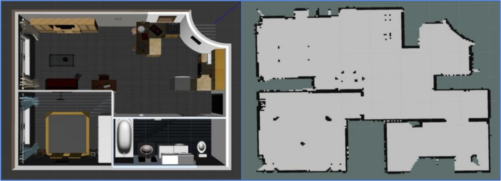

# Frontier Exploration with ROS1 and Gazebo

This repository contains a project for autonomous frontier exploration using ROS1 and Gazebo. The system allows a mobile robot Turtlebot 3 to explore unknown environments by identifying frontier cells and navigating to them, expanding its knowledge of the map.

## Overview

The exploration algorithm is designed to:
1. **Identify Frontier Cells**: Unmapped cells adjacent to mapped areas are marked as frontiers.
2. **Group Frontier Cells**: Cells are clustered into frontier lines to form exploration targets.
3. **Navigate to Frontier Goals**: The robot selects and navigates to the centroid of the largest frontier group.
4. **Evaluate Exploration Progress**: The percentage of newly mapped areas is calculated to assess exploration completion.

## Demonstration

To see the exploration process in action, click the image below to watch the demonstration video on YouTube:

## Dependencies

- **ROS1**: Robot Operating System (tested on ROS Melodic).
- **Gazebo**: Simulation environment for robot navigation.
- **RViz**: Visualization tool for monitoring exploration progress.
- **move_base**: Enables autonomous navigation.
- **map_server**: For loading and managing map data.
- **amcl**: Adaptive Monte Carlo Localization for robot positioning.
- **sensor_msgs** and **geometry_msgs**: Required for sensor data and geometry message types.
- **actionlib**: For asynchronous task management.
- **tf**: Manages coordinate frame transformations.
- **costmap_2d** (optional): Adds cost mapping for enhanced navigation.
  
